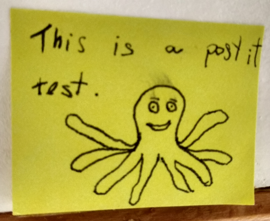

this is a test entry[^bla] for testing tests

This is a python test code:

~~~ python
import numpy as np

test0 = np.zeros(42)
test1 = np.ones(137)
~~~

This a nice
[Higgs Lagrangian](https://en.wikipedia.org/wiki/Higgs_boson#Technical_aspects_and_mathematical_formulation)
for testing \\( \LaTeX \\) :

$$ \mathcal{L}_H = \left|\left(\partial_\mu -i g W_\mu^a \tau^a -i\frac{1}{2} g' B_\mu\right)\phi\right|^2 + \mu^2 \phi^\dagger\phi-\lambda (\phi^\dagger\phi)^2 $$

A pen test for testing a post-it photo:

`some Markdown tests`:

- **bold**
- *italics*
  - ~~list test~~
  -  [a link](http://pudim.com.br)

Some more test code:

~~~ julia
using QuantumOptics
b = FockBasis(50)
a = destroy(b)
at = create(b)
H = 0.5*(a^2 + at^2)
psi0 = fockstate(b, 3)
tout, psit = timeevolution.schroedinger([0:0.25:1;], psi0, H)

using PyPlot
x = [-5:0.1:5;]
for i in 1:4
    subplot(2, 2, i)
    Q = qfunc(psit[i], x, x)
    pcolor(x, x, Q)
end
tight_layout()
savefig("fock.png")
~~~

Unicode/Emoji test:

🦕 
🦖  🐦 
🐉  🔥  🐙 
🦑  🐈  🐾  🐢 
🐞  🦋  🐌 
🧪  🧬 
🧬

Twemoji test: :+1: :jack_o_lantern: :open_mouth: :stuck_out_tongue: :scream:

It works!

It works?

<blockquote class="blockquote">

This is a reminder for me in the future: _it **is possible** to have_
`markdown` inside `HTML` code blocks!!

<footer class="blockquote-footer">Me, in the past.</footer>
</blockquote>

*[test]: test!
[^bla]: [blablabla](https://lmgtfy.com/?q=bla)
