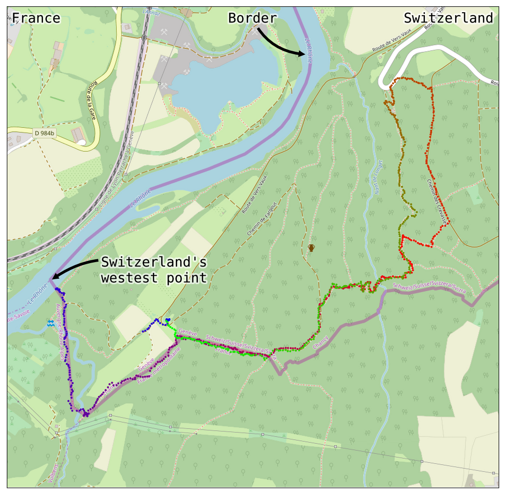

Yesterday my supervisor and I went to a hike to the _Swiss Far West_, the westest
part of Switzerland. Unfortunately, we couldn't go to the precise westest point
of the border with France, because that's in the middle of the river _Le
Rhône_[^1] and we didn't want to get inside the water.

I recorded our hike using [OsmAnd](https://osmand.net/), a very nice app for
maps and location and finding out how to go from one place to another. And all
that offline! You only need internet connection to download the app :) Oh, and
it's free!

This app gave me [this GPX file](hike.gpx). It's basically an XML file with
coordinates (latitude, longidute, elevation and time) and some more
information. You can read more about the format on
[WikiPedia](https://en.wikipedia.org/wiki/GPS_Exchange_Format).

I found this [gpxpy](https://github.com/tkrajina/gpxpy) library to work with
GPX files. It's quite easy to use it together with
[matplotlib](https://matplotlib.org/):

~~~ python

~~~

And this codes gives the path of our hike, after about 150 seconds:

<video width="100%" height="100%" loop="True" controls>
  <source src="hike.mp4" type="video/mp4">
  Your browser does not support the HTML5 video tag :(
  click <a href="hike.mp4"> here </a> to view the animation.
</video> 

And that's pretty cool :sunglasses:

Lets extract some more information about this GPX file:

~~~ python

~~~

~~~ julia
$ python infos.py 

distance: 5892.264830266586 m
duration; 5550 s
started: 2018-09-24 07:36:10
ended: 2018-09-24 09:08:40
elevation extremes: (320.36, 429.36) m
Max speed:  1.8713130924592616 m/s
Boundaries:  [46.1285393, 46.13805, 5.9561619, 5.9720922]
~~~

Nice! But the nicest thing would be a simple way to add the GPX coordinates on
top of the map of the region. The library
[geotiler](https://github.com/wrobell/geotiler) provides a way to get the map
from [OpenStreetMap](http://openstreetmap.org/). You might need
[Redis](https://redis.io/) running as server in the background for _geotiler_
to work. Here's the code:

~~~ python

~~~

It reads the GPX file, gets the map of the region from OpenStreeMap, adds
coloured points showing the path and some texts. The result:

The blue points mark the beginning of the hike. And it changes colours all the
way to the green points, marking the end of our 5892.3 meters walk :) As you
can see, we got pretty close to the westest Swiss point! For
some reason, my phone lost GPS connection in the beginning, that's why it's
missing some blue points.

*[middle]: Latitude: 46.1323565, Longitude: 5.9559113
*[free]: as in free beer
*[GPX]: GPS Exchange Format

[^1]: [Latitude: 46.1323565, Longitude: 5.9559113](https://osm.org/go/0CFL8Bq5?m=)