Last week we had another _walking meeting_! This time, we went to the village
of Essertines, near Geneva, Switzerland. It's a very lovely place, with old
beautiful buildings, small roads and wineries.

[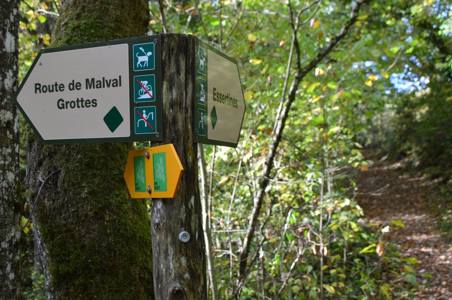](https://www.flickr.com/photos/heitorpb/30468016197/in/album-72157702559519395/)

Essertines belongs to the municipality of Dardagny. 1 861 people live in
there[^wtf]. There are 16 winemakers[^winemakers]. The vast majority of
apartments there have 3 rooms[^wtf].

[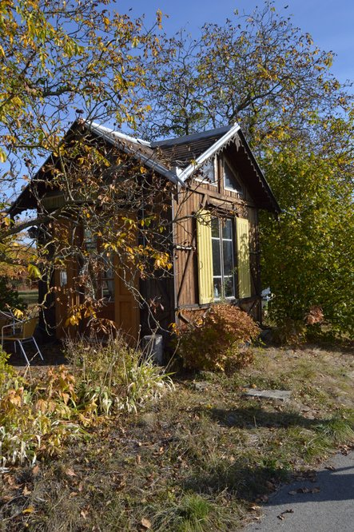](https://www.flickr.com/photos/heitorpb/44493621755/in/album-72157702559519395/)

We started the hike at about 10 in the morning. The weather was very nice:
sunny day, not too hot, not too cold and not humid :) The ladies in blue took
the liberty of being the guide:

[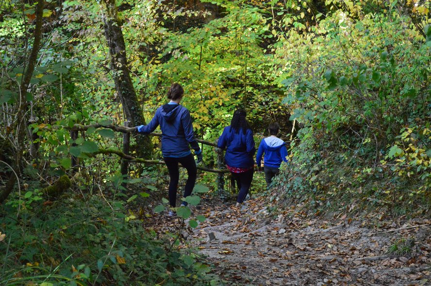](https://www.flickr.com/photos/heitorpb/30468018287/in/album-72157702559519395/)

There are some caves in that region, made in the second half of the 19th
century, to extract _bitumen_[^oil]. It is a black, gooey, icky sticky form of
petroleum. It's main use is to make asphalt and to waterproof things[^wikiOil].
I never imagined that it would be easy to get some petroleum for myself. But in
this region, you can literally stick your fingers in the rock and get that
goofy stuff for you :sunglasses:

[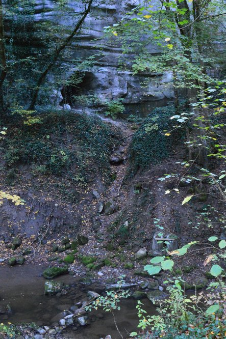](https://www.flickr.com/photos/heitorpb/45357033732/in/album-72157702559519395/)

I think someone tried to make a tent there, to rest after a long day of
extracting oil. Or maybe the gnomes built that to keep an eye on people? That
would explain why there's no more exploration of bitumen there...

[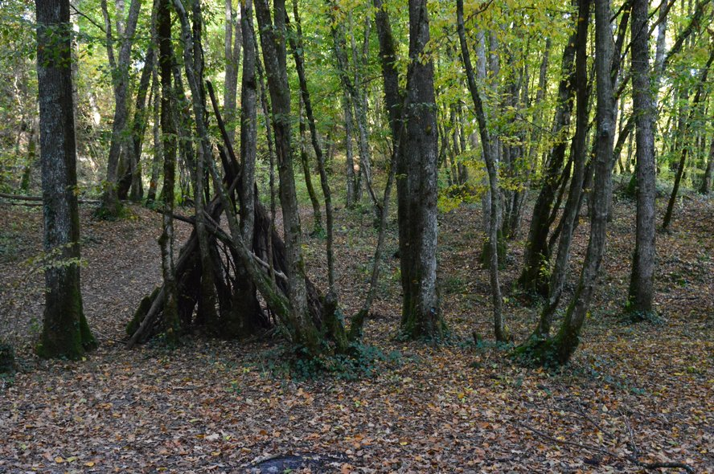](https://www.flickr.com/photos/heitorpb/30468017267/in/album-72157702559519395/)

We continued walking through the forest :)

[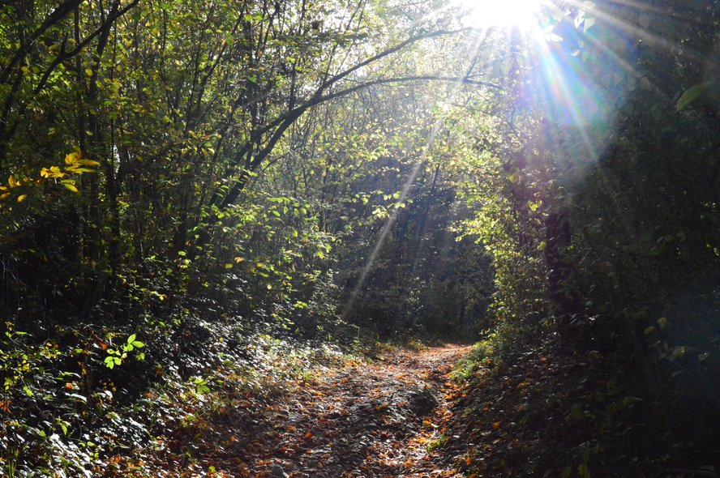](https://www.flickr.com/photos/heitorpb/45357034362/in/album-72157702559519395/)

I really like those stairs built there. They are very minimalist, not fancy
at all and very, very gracious.

[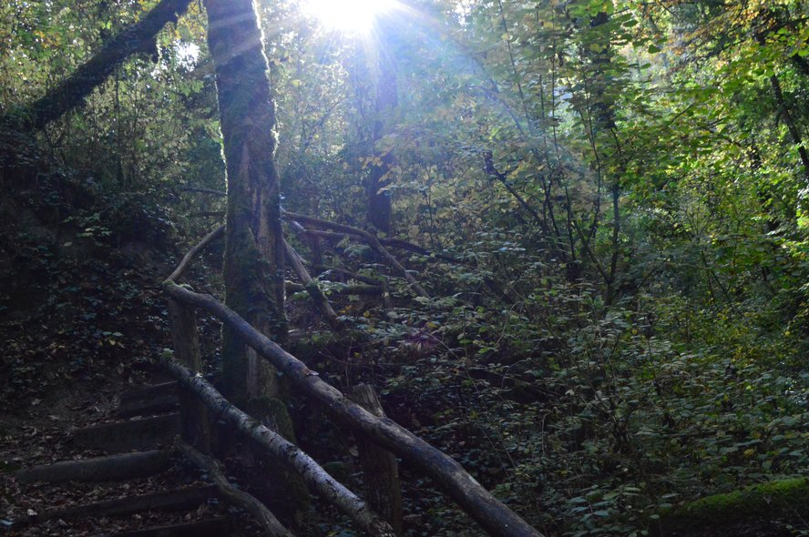](https://www.flickr.com/photos/heitorpb/30468019457/in/album-72157702559519395/)

And then there was The Bridge! We stayed a few minutes there, looking at the funny
crustaceans in the river.

[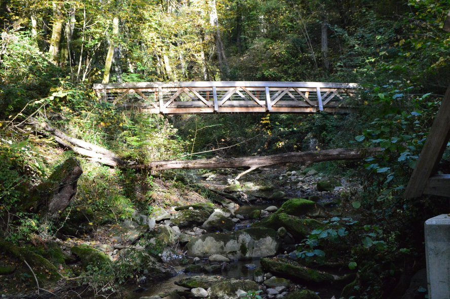](https://www.flickr.com/photos/heitorpb/45357035272/in/album-72157702559519395/)

The path looks very charming looking from The Bridge.

[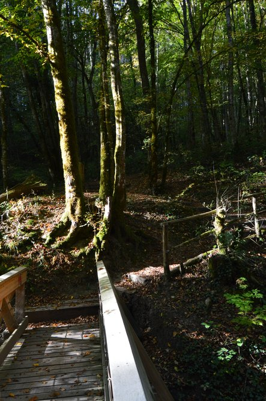](https://www.flickr.com/photos/heitorpb/45357035952/in/album-72157702559519395/)

And, suddenly, the forest was gone. The view was dominated by grape vines!

[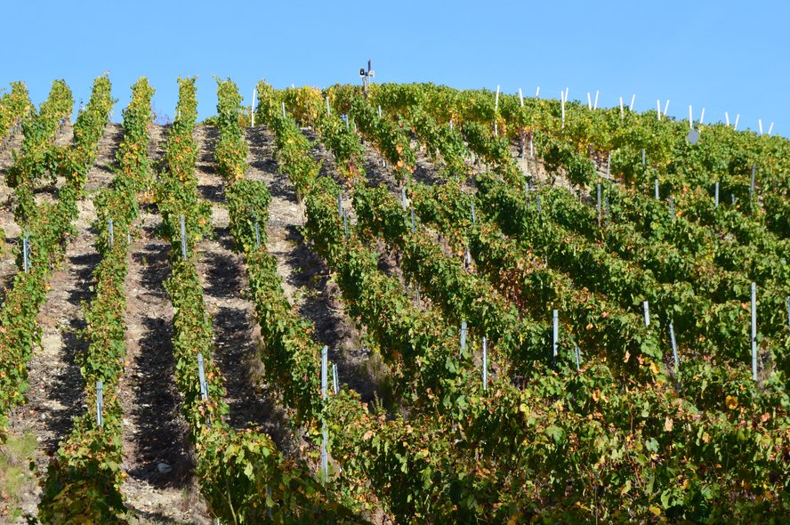](https://www.flickr.com/photos/heitorpb/45357036642/in/album-72157702559519395/)

Looking back, we could see the first signs of Autumn. Some trees were not that
green anymore. We can spot some yellow leafs and also some almost-red ones.

[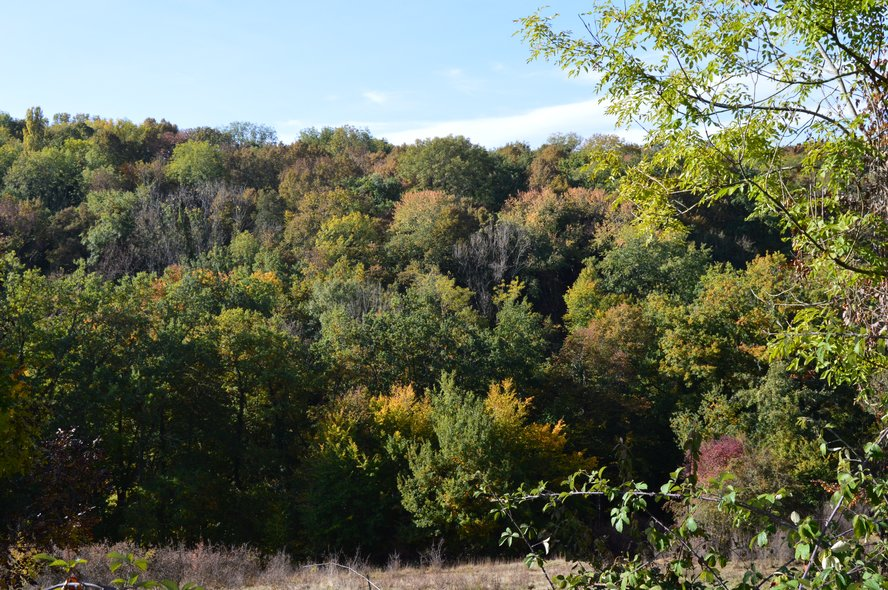](https://www.flickr.com/photos/heitorpb/30468021827/in/album-72157702559519395/)

The grapes also change their colours. The contrast of the red, yellow and green
leafs is amazing!

[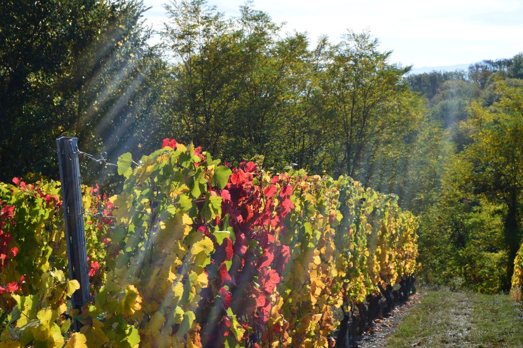](https://www.flickr.com/photos/heitorpb/44493620835/in/album-72157702559519395/)

I think I read in a sign in the vineyard they were Cabernet Sauvignon.

[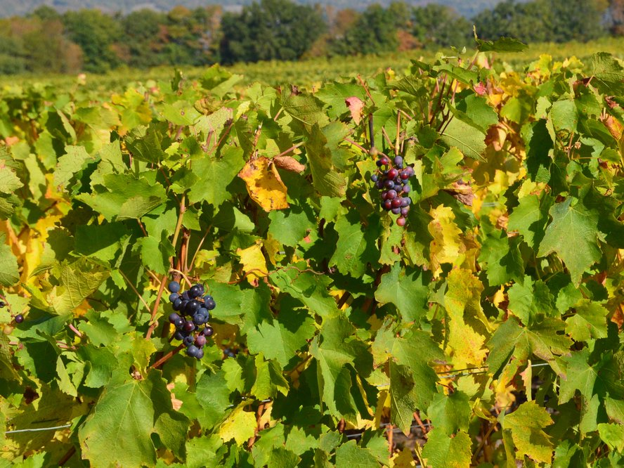](https://www.flickr.com/photos/heitorpb/44493619915/in/album-72157702559519395/)

We also received the visit of a lonely, enchanting rider.

[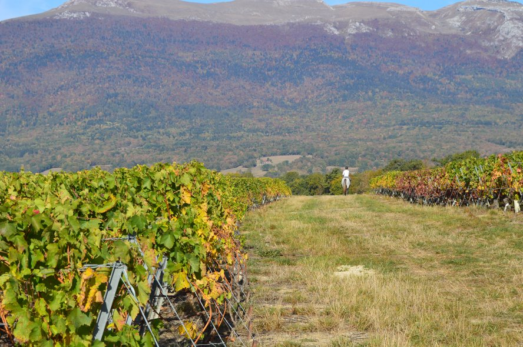](https://www.flickr.com/photos/heitorpb/30468023777/in/album-72157702559519395/)

In the background, the majestic Jura Mountains!

[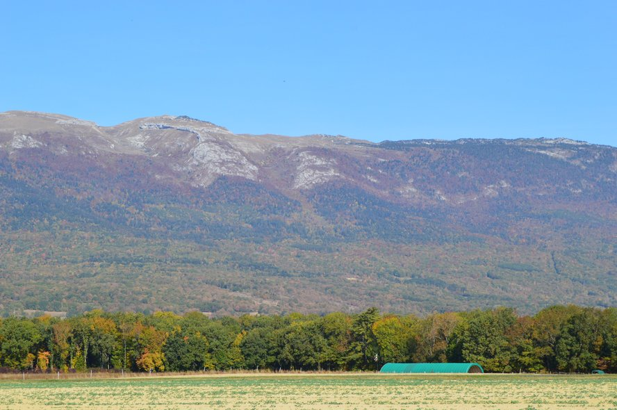](https://www.flickr.com/photos/heitorpb/45357037202/in/album-72157702559519395/)

On our way through the village to the car, we found an iron peacock, guarding a
flower well.

[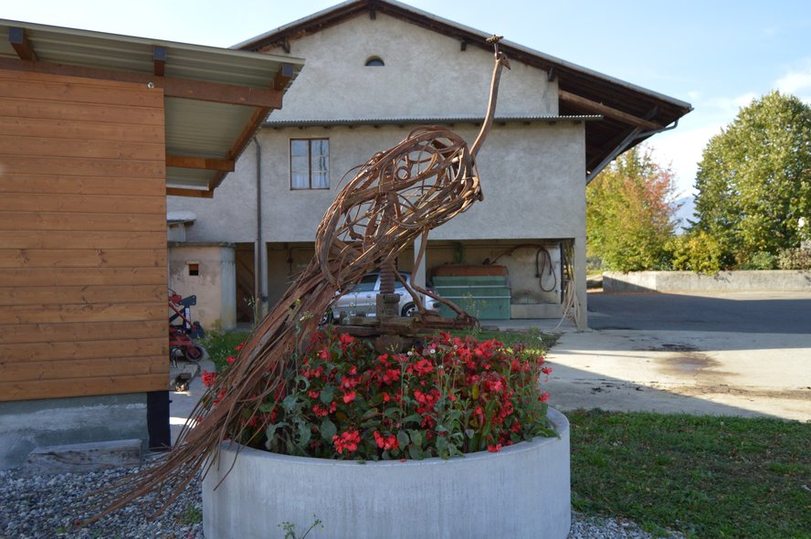](https://www.flickr.com/photos/heitorpb/30468024607/in/album-72157702559519395/)

That was the end of our meeting. A very productive one, if you ask. Everyone
was actively involved! No one falling asleep or leaving for a coffee and never
returning. Our hike was ~3.6 km long at an average speed of 1.25
m/s[^analysis]. I burned ~185 kcal[^endomondo].

[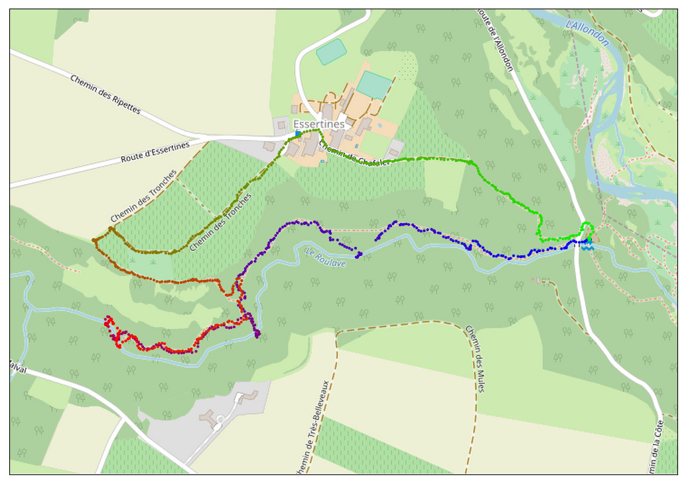](imgs/map.png)

Back to the car. Back to CERN. Back to work ⚛️

 

---

[^wtf]: [Dardagny - Wikipedia](https://fr.wikipedia.org/wiki/Dardagny) (Page consultée le juin 13, 2018).
[^winemakers]: [Dardagny - Vignerons - Viticulteurs](http://www.dardagny.ch/index.php/vie-economique/vignerons-viticulteurs)
[^endomondo]: [Endomondo](https://www.endomondo.com/users/25410601/workouts/1215399714)
[^oil]: [Guidebook: geology and archaeology of Geneva - Société de physique et d’histoire naturelle de Genève](https://www.unige.ch/forel/files/5114/8949/5654/Guide_Geneve.pdf)
[^wikiOil]: [Asphalt - Wikipedia](https://en.wikipedia.org/wiki/Asphalt)
[^analysis]: [Hiking Analysis](https://github.com/heitorPB/HikingAnalysis)
