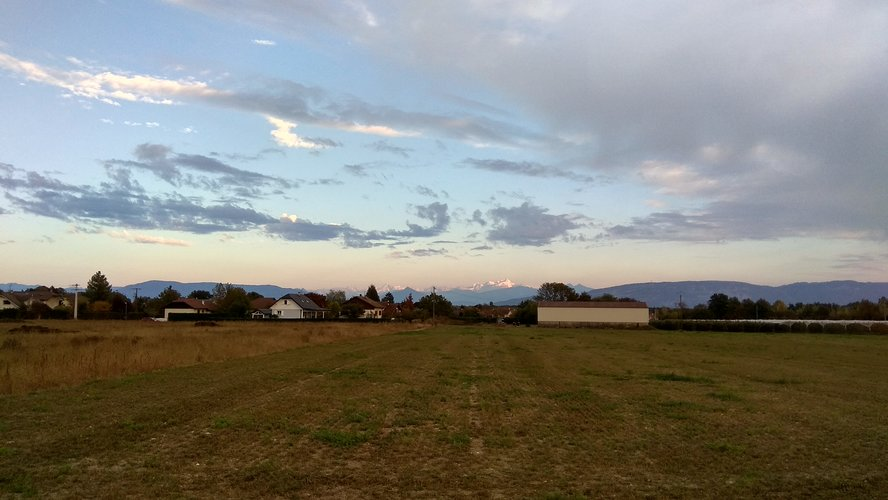

So, I decided to hunt treasures 😎 Real treasures, not the ones from movies or
TV series. Some real humans hid real treasures around the world. And of course
they created real maps with instructions. This way other people can find those
treasures!

They[^whom] named this 'sport' _Geocaching_. It's quite a fancy name, but
_treasure hunting_ sounds much cooler. The concept it simple: an adventurous
person hides a small treasure somewhere. They then create the _treasure map_.

The treasure is also called a _cache_. It is mainly a _log book_.
When you find one, you should sign and celebrate! There might also have
something else for trade, like an used sock or foreign money. The treasures
have an ethereal value, not a financial one. The reward is _locating_ it, not
selling gold. It's in a container that should be waterproof and able to
survive the local weather and police. The police just loves exploding
them[^bomb1][^bomb2][^bomb3][^bomb4][^bomb5][^bomb6][^bomb7]!

We are in the 21st century, it doesn't make any sense to make maps using
papyrus and quill pens. That is really cool but not compatible with today's
technology. The current treasure maps rely on _GNSS_, such as _GPS_ and
_GLONASS_. The map is the approximate co-ordinates of the treasure.
Sometimes with some more tips or with instructions to get to the exact
place.

The [Geocaching](https://www.geocaching.com/) website maintains a big list of
treasure maps around the world. Go check if there's a treasure near you right
now! And there's the [c:geo](https://www.cgeo.org/) app to use in an Android
phone. For free. Yep, it's free to hunt treasures 😃

I went with my friend Przemysław to hunt two treasures in the French side of
Geneva. It was a very fun adventure. This is where we went (we started near the
blue dots):

There was a very nice house and we decided to get a closer look, before the
quest.

We then decided to go for our first treasure. Near the Saint-Pierre de Pouilly
Church. This church was build in the [Roman Era](https://en.wikipedia.org/wiki/Roman_Era),
in the 13th century or earlier[^church].

After looking around for a while, we decided to give up. Yep. Really. But why
not a last look around? Then we found it! Hidden there! There was it:

A small piece of paper inside a plastic bag! The front was full, so we squeezed
our names in the back :) The first treasure we found! We were so excited! Can
you imagine finding a treasure?!?

Then we walked to the second treasure! We walked to the region in the map with
lots of brown (?), green (?) and purple (?) points. There we found something
unexpected.

In the middle of nowhere, there was a fence surrounding it. This way the cattle
don't get inside. It's in the end of a small forest there. There was it:

This place is lovelly! Hidden from society, a small temple. Simple and yet
breathtaking.

The second treasure was supposed to be there. We didn't find it though...

That was our adventure! 191 kcal burned, 3.74 km walked, 1 hour and 16 minutes.
Our success rate is quite low, 50%. But it was very fun! And the landscape is
awesome!

 

---

*[co-ordinates]: latitude and longitude
*[GNSS]: Global Navigation Satellite System
*[GLONASS]: The Soviet version of GPS
[^whom]: The guys in [this mailing list](https://groups.yahoo.com/neo/groups/gpsstash/conversations/topics/62).
[^bomb1]: [link](https://archive.is/20120904171554/http://www.mywesttexas.com/articles/2010/01/08/news/top_stories/pipe_bomb_geochaching_geocache_midland_academy_sports.txt)
[^bomb2]: [link](https://www.gcdailyworld.com/story/1890701.html)
[^bomb3]: [link](https://www.deseretnews.com/article/635160668/Detonated-bomb-turns-out-to-be-box-of-toys.html)
[^bomb4]: [link](https://web.archive.org/web/20081202115708/http://www.canada.com/ottawacitizen/news/story.html?id=c7628126-a0f6-4a9e-a396-a40fa1948eab)
[^bomb5]: [link](http://articles.glendalenewspress.com/2013-01-14/news/tn-818-0114-authorities-determine-suspicious-object-found-on-glendale-power-pole-to-be-safe_1_power-pole-suspicious-object-bomb-squad)
[^bomb6]: [link](https://www.bbc.com/news/uk-england-leeds-14039229)
[^bomb7]: [link](https://www.ibtimes.com/geocaching-awesome-scavenger-hunt-or-bomb-threat-waiting-happen-296371)
[^church]: [Saint-Genis-Pouilly - Wikipedia](https://en.wikipedia.org/wiki/Saint-Genis-Pouilly)