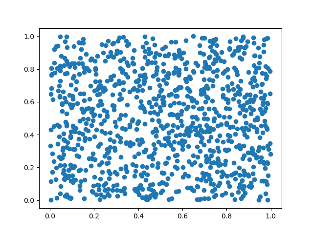

I'm working on a simulation that generates gigabytes of raw data. But I am a
Physicist: I _need plots_, not tables! So I made a set of scripts in Python
that parses all this data and generates about 50 plots.

It's not a problem to generate lots of pdf's with the plots. It's not a problem
to write the Python code to parse the data and generate the plots.
[Pandas](https://pandas.pydata.org/) makes our life easy to read data and
[Matplotlib](https://matplotlib.org/) has a nice interface to turn data in
figures.

I have a code with a structure like this:

~~~ python
For every parameter alpha:
   Read the relevant Data
   Process the data
   Make and save the plot
~~~

In Python words:

~~~ python

~~~

If I run this code, It will create 50 png's in the folder `plots/`, similar to
this one:

So, what's the problem here?

Try running the code!

~~~ python
$ python plot.py
plot.py:22: RuntimeWarning: More than 20 figures have been opened. Figures created through the pyplot interface (`matplotlib.pyplot.figure`) are retained until explicitly closed and may consume too much memory. (To control this warning, see the rcParam `figure.max_open_warning`).
  fig = plt.figure()
~~~

This warning appears several times. And it is a _warning_, not an error: the
code will _probably_ work fine.
It says `and may consume too much memory`. But how much is too much?
Let's use the [GNU time](https://www.gnu.org/software/time/) command to
discover the amount of memory used:

~~~ python
$ /usr/bin/time -f "%M" python bad-example.py
bad-example.py:22: RuntimeWarning: More than 20 figures have been opened.
Figures created through the pyplot interface (`matplotlib.pyplot.figure`) are
retained until explicitly closed and may consume too much memory. (To control
this warning, see the rcParam `figure.max_open_warning`).
  fig = plt.figure()
 ... ommiting several repeated messages here
bad-example.py:22: RuntimeWarning: More than 20 figures have been opened.
Figures created through the pyplot interface (`matplotlib.pyplot.figure`) are
retained until explicitly closed and may consume too much memory. (To control
this warning, see the rcParam `figure.max_open_warning`).
  fig = plt.figure()
  182032
~~~

The last number is the peak memory usage, in kbytes. In this case: 182032
kbytes.

Now, let's fix the warning. The problem is that we have too many figures
opened: we need to close them. The simplest way is to call `plt.close(fig)`
when the figure is not needed anymore:

~~~ python

~~~

Now, let's see how much memory it uses:

~~~ python
$ /usr/bin/time -f "%M" python good-example.py
106652
~~~

:sunglasses:

About 75000 kbytes saved!